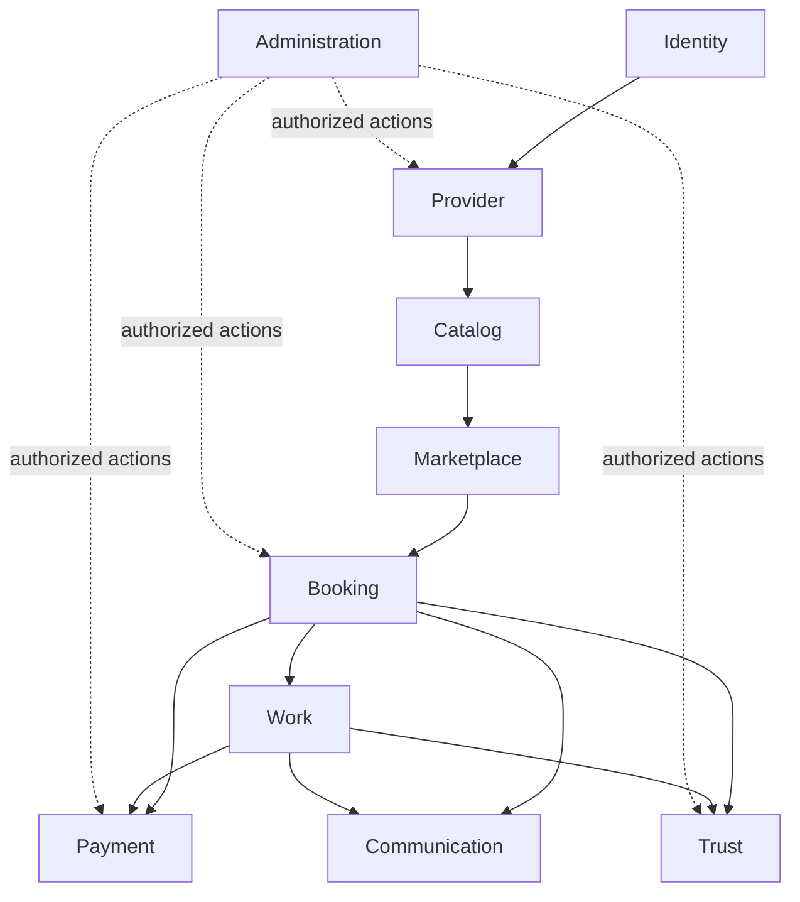

# FixHub Domain Map

## Purpose

This document defines the target domain boundaries of the FixHub modular monolith.

Its purpose is to establish which domain owns each business concept before entities,
database tables, repositories, APIs, or business packages are implemented.

The terminology in this document follows `domain-glossary.md`.

## Architecture Baseline

FixHub is implemented as a modular monolith using Spring Boot and Spring Modulith.

Each business domain maps to a top-level package beneath:

`com.fixhub.platform`

Spring Modulith therefore treats each direct business package as an application module.

The existing `common` module is the shared kernel and is explicitly declared `OPEN` as
defined by ADR 0005. Business modules remain `CLOSED` by default.

Module boundaries describe business ownership. They must not be bypassed merely because
all modules execute in the same application or use the same database.

FH-005 defines these boundaries conceptually. It does not create business entities,
database tables, repositories, migrations, controllers, or module packages.

## Target Modules

| Module | Target Package | Primary Responsibility |
|---|---|---|
| Identity | `identity` | Accounts, credentials, verification, authentication sessions, and global platform roles |
| Provider | `provider` | Providers, branches, memberships, provider roles, approvals, and operating hours |
| Catalog | `catalog` | Categories, services, translations, provider offerings, and pricing indications |
| Marketplace | `marketplace` | Discovery, favorites, service requests, matching, provider quotes, revisions, and quote acceptance |
| Booking | `booking` | Direct and accepted-quote booking creation, slots, booking lifecycle, and cancellation |
| Work | `work` | Assignment, diagnosis, work progress, evidence/media, completion, and warranty |
| Trust | `trust` | Verified reviews, review responses, rating aggregates, and complaints |
| Payment | `payment` | Payment intents, immutable ledger, commissions, refunds, earnings, and reconciliation |
| Communication | `communication` | Conversations, messages, notification outbox, and notification preferences |
| Administration | `administration` | Platform configuration, approval worklists, moderation, and cross-domain operational views |

`common` is infrastructure shared by the business modules and is not itself a FixHub
business domain.

## Ownership Principles

### One Authoritative Owner

Each business concept has exactly one authoritative owning module.

The owning module defines the concept's invariants, lifecycle, and permitted state changes.
Other modules may reference the concept, consume published information about it, or maintain
explicit read models, but they must not create a competing writable source of truth.

Ownership applies to behavior as well as data. A module must not reproduce another module's
business rules merely to avoid collaborating with the owning module.

### References Do Not Transfer Ownership

A cross-domain relationship does not transfer ownership of the referenced concept.

For example, a Membership may identify an Account, but the Provider module does not own the
Account. Likewise, a Booking may identify a Provider Offering, but the Booking module does
not own the offering or the service catalog.

Cross-module references should use stable identifiers or explicit contract data. They must
not expose another module's mutable internal entities as shared objects.

Physical database relationships and persistence mappings will be decided later. A database
foreign key, if one is eventually used, does not grant permission to modify another module's
state.

### Collaboration Through Contracts

Business modules collaborate only through explicitly exposed module APIs or published domain
events.

A synchronous module API is appropriate when the caller requires an immediate business
decision or result. A domain event is appropriate when another module reacts to a completed
business fact without controlling the originating transaction.

Modules must not call another module's repositories, internal services, or non-exposed domain
types. Cross-module workflows must also avoid circular compile-time dependencies.

### Transaction and Failure Boundaries

The module that owns a business operation controls its local transaction and invariants.

Consequences in other modules may be coordinated through durable events, idempotent handlers,
or other explicit integration mechanisms defined in later specifications.

Failure of a secondary action, such as notification delivery, must not cause the originating
business operation to be repeated unless its owning domain explicitly defines that behavior.

### Shared Kernel Discipline

The `common` module contains only deliberately shared technical building blocks and stable
cross-cutting primitives.

It must not own Provider, Booking, Payment, or other business-domain behavior. Business
concepts must not be moved into `common` merely because several modules use them.

## Authoritative Ownership Map

| Business Concepts | Authoritative Module | Ownership Boundary |
|---|---|---|
| Account, credentials, verification, sessions, and global roles | Identity | Other modules reference an Account identity; they do not manage authentication state or global roles |
| Provider, Branch, Membership, Provider Role, Approval, and Operating Hours | Provider | Membership authorization and Provider lifecycle remain separate from Identity authentication |
| Category, Service, Translation, Provider Offering, and Pricing Indication | Catalog | Provider and Branch identifiers may be referenced, while their lifecycle remains Provider-owned |
| Discovery, Favorite, Service Request, Matching, Provider Quote, Quote Revision, and Quote Acceptance | Marketplace | Marketplace owns pre-booking demand and quotation; it does not own the resulting Booking |
| Booking, Direct Booking, Accepted-Quote Booking, Slot, Booking Status Lifecycle, and Cancellation | Booking | Booking owns the engagement lifecycle and references, rather than absorbs, quotation and work execution |
| Assignment, Diagnosis, Progress, Media, Completion, and Warranty | Work | Work owns service execution; it does not create a second Booking lifecycle |
| Review, Review Response, Rating Aggregate, and Complaint | Trust | Trust evaluates verified platform activity without taking ownership of Booking, Work, or Payment records |
| Payment Intent, Ledger, Commission, Refund, Earnings, and Reconciliation | Payment | The immutable Ledger is financial truth; Booking and Provider must not maintain competing balances |
| Conversation, Message, Notification Outbox, and Notification Preference | Communication | Communication owns message and delivery records, while referenced business context remains with its source module |
| Platform Configuration, Approval Queue, Moderation, and Operational View | Administration | Administrative views and actions do not transfer ownership of the underlying domain records |

The Administration module may initiate an authorized action against another domain, but the
owning business module must validate and perform the resulting state change.

Ownership decisions in this map are architectural constraints. Later specifications may add
detail, but they must not silently redefine these boundaries.

## Allowed Cross-Domain Relationships

The relationships below identify permitted business collaboration between modules. They do
not transfer ownership and do not authorize direct access to another module's internal
entities, repositories, or services.

| Relationship | Permitted Business Purpose | Boundary Rule | Typical Interaction |
|---|---|---|---|
| Identity and Provider | Associate an authenticated Account with a Provider or Branch through Membership | Identity owns the Account and global roles; Provider owns Membership and Provider Roles | Stable Account identifier, exposed Identity API, and identity lifecycle events |
| Provider and Catalog | Associate Provider Offerings with an eligible Provider or Branch | Provider owns Provider and Branch lifecycle; Catalog owns the offering and its catalog meaning | Stable Provider and Branch identifiers, eligibility API, and lifecycle events |
| Catalog and Marketplace | Support service discovery, requests, matching, and quotation against available services and offerings | Marketplace may use catalog data but must not redefine Categories, Services, Translations, or Offerings | Exposed catalog queries, search projections, and catalog-change events |
| Provider and Marketplace | Identify eligible Providers and authorize Provider members to respond to Service Requests | Marketplace owns requests and quotes; Provider owns Provider status, Branches, Memberships, and permissions | Eligibility and authorization APIs together with Provider lifecycle events |
| Marketplace and Booking | Create an Accepted-Quote Booking from an accepted Provider Quote | Marketplace owns quotation history; Booking owns the resulting engagement lifecycle | Explicit quote-acceptance contract containing an immutable snapshot of agreed terms |
| Provider, Catalog, and Booking | Create and validate Direct Bookings and preserve the selected Provider, Branch, Service, Offering, slot, and commercial terms | Booking references or snapshots required facts without taking ownership of Provider or Catalog records | Exposed validation APIs, stable identifiers, and transaction-time snapshots |
| Booking and Work | Start and perform work for an eligible Booking and request valid Booking lifecycle transitions as work advances | Booking remains lifecycle authority; Work remains execution authority | Booking events and exposed Booking commands or decision APIs |
| Booking, Work, Provider, and Trust | Establish verified review eligibility, review subjects, responses, and complaint context | Trust owns reputation and complaint records but cannot modify source Booking, Work, or Provider history | Eligibility APIs, stable identifiers, and completed business events |
| Booking, Work, Provider, and Payment | Collect payment, record financial movements, calculate commission and earnings, and determine payout eligibility | Payment owns financial state and the Ledger; other modules must not maintain competing financial balances | Payment APIs, immutable transaction facts, and idempotent domain-event handling |
| Identity and Communication | Identify Conversation participants and apply Account notification preferences | Communication owns Conversations, Messages, preferences, and delivery records; Identity owns Accounts and authentication | Stable Account identifiers and exposed authorization or identity contracts |
| Business modules and Communication | Associate Conversations with business context and create notifications from completed business facts | Communication may reference the originating context but cannot change its lifecycle | Context authorization APIs and published domain events |
| Administration and business modules | Build operational views, perform moderation, and initiate authorized administrative actions | Administration does not become the source of truth; the owning module validates and performs every state change | Read models, exposed query APIs, domain events, and authorized module commands |

### Relationship Rules

An allowed relationship does not require every listed interaction to be implemented
immediately. It establishes the boundary within which later specifications may design the
collaboration.

Cross-module references must use stable identifiers or explicit contract data. Historical
business meaning that may change later, such as accepted quote terms, selected offering
details, or commission policy, must be captured as an appropriate transaction-time snapshot.

Published events describe completed business facts. They must not expose mutable internal
entities or allow a consuming module to rewrite the source module's history.

Where modules exchange information in both business directions, the implementation must
still avoid circular compile-time dependencies. Later module specifications must define the
API, event, or orchestration direction explicitly.

Any cross-domain relationship not listed here is prohibited by default and requires an
architecture review before implementation.

## Primary Module Interaction Flow

The following diagram shows the principal flow of business facts and hand-offs. Arrows do not
represent entity ownership or permission to access module internals.

Identity establishes platform identity, while Provider and Catalog establish the supply side
of the marketplace. Marketplace coordinates discovery, requests, and quotations before
handing an accepted commercial interaction to Booking.

Booking remains the engagement lifecycle authority. Work performs the agreed service, while
Payment, Trust, and Communication react through their own contracts and retain ownership of
their respective records.

Administration may observe activity across modules and initiate authorized actions, but each
target module remains responsible for validating and applying its own state changes.
