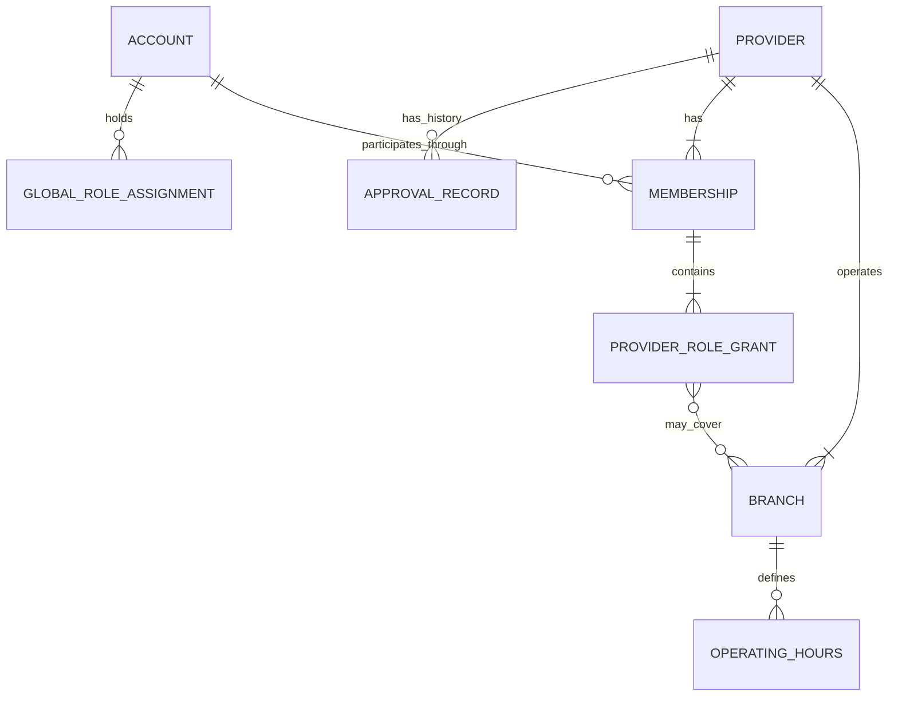
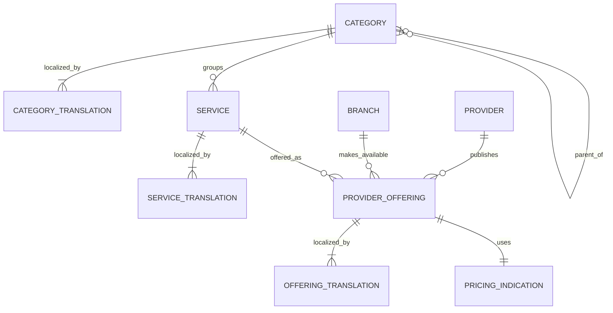
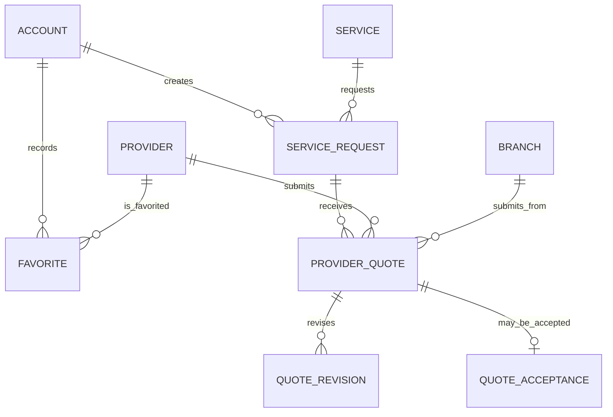
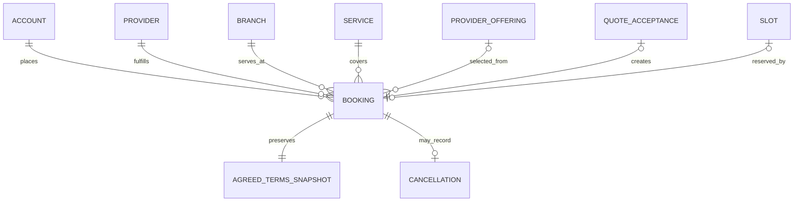
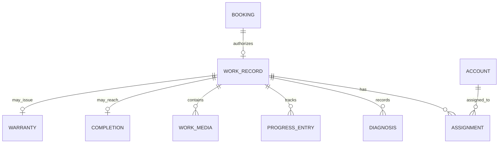
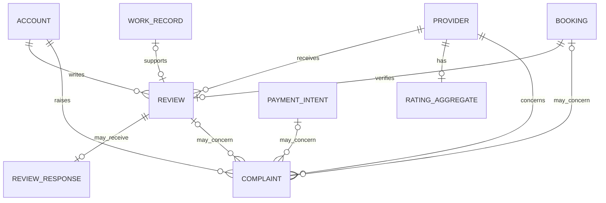
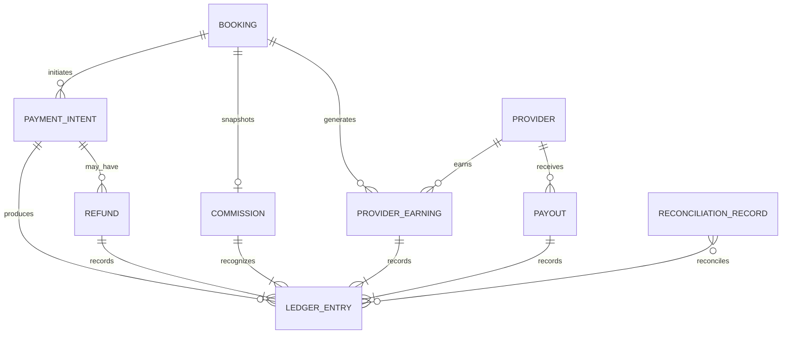
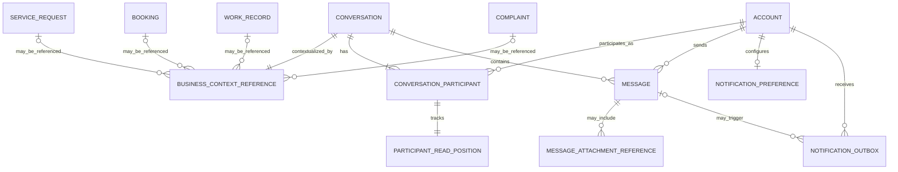
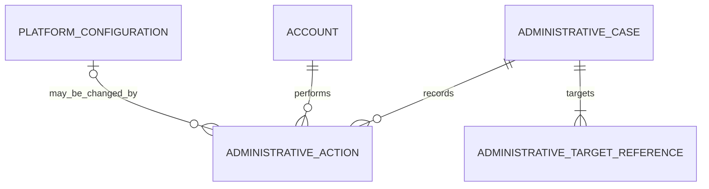

# FixHub Conceptual Entity-Relationship Model

## Purpose

This document presents FixHub's initial conceptual entity-relationship model. It translates the
approved domain glossary, module ownership map, and architecture decisions into business
relationships and cardinalities.

The model is intentionally conceptual. It identifies business concepts and their relationships,
not database tables, columns, foreign keys, join tables, indexes, JPA entities, inheritance
strategies, repositories, or migration scripts.

The diagrams are divided into related business areas so that ownership and cardinality remain
readable. Together they form one conceptual model for the modular monolith.

## Architecture consistency

This ERD follows these authoritative decisions:

- ADR 0005 defines FixHub as a Spring Modulith modular monolith.
- ADR 0006 defines one canonical Provider with `CENTER` and `INDIVIDUAL` types.
- ADR 0007 requires every Provider to have a Branch and defines Provider- and Branch-scoped
  Membership authorization.
- ADR 0008 defines separate locale-based translation records instead of language-specific columns.
- ADR 0009 defines persisted, context-authorized Conversations and Messages before real-time
  transport.

If this ERD conflicts with an accepted ADR, the ADR takes precedence and the ERD must be corrected.

## Modeling rules

- Every owned business concept belongs to exactly one module.
- A relationship to another module does not transfer ownership.
- Cross-module relationships represent stable identifiers, snapshots, or exposed contracts rather
  than permission to use another module's repository or mutable entity.
- Cardinalities describe business rules, not a proposed physical schema.
- Historical meaning that may change later is preserved through an appropriate transaction-time
  snapshot.
- `Customer` is a role played by an Account in a customer interaction, not a separate identity
  aggregate.
- `CENTER` and `INDIVIDUAL` classify Provider; they are not separate Provider entities.
- Direct Booking and Accepted-Quote Booking are creation paths or origins of Booking, not competing
  Booking aggregates.
- Discovery, Matching, queues, dashboards, and operational views are capabilities or projections
  unless the glossary explicitly defines an owned record.
- Read models and cached projections are omitted when they would duplicate their authoritative
  source concepts.
- Implementation-only join entities are omitted unless the relationship itself has domain meaning.
- Unlisted cross-module relationships remain prohibited until an architecture review approves them.

## Module ownership inventory

| Module | Owned concepts represented in the conceptual model | Clarification |
|---|---|---|
| Identity | Account and global role assignments | Customer and authenticated Provider member are roles played by Account |
| Provider | Provider, Branch, Membership, Provider Role Grant, Approval Record, and Operating Hours | Provider owns supply-side identity, organization, participation, and authorization |
| Catalog | Category, Service, Translation Record, Provider Offering, and Pricing Indication | Catalog owns service meaning and the services made available by Providers and Branches |
| Marketplace | Favorite, Service Request, Provider Quote, Quote Revision, and Quote Acceptance | Discovery and Matching are capabilities that operate on these records and approved projections |
| Booking | Booking, Slot, Cancellation, and agreed-term snapshot | Booking owns the engagement lifecycle after direct creation or accepted quotation |
| Work | Work Record, Assignment, Diagnosis, Progress Entry, Work Media, Completion, and Warranty | Work owns execution evidence but does not replace Booking lifecycle authority |
| Trust | Review, Review Response, Rating Aggregate, and Complaint | Trust owns reputation, review, response, and dispute records |
| Payment | Payment Intent, Ledger Entry, Commission, Refund, Provider Earning, Payout, and Reconciliation Record | Payment is the sole owner of financial state and balances |
| Communication | Conversation, Message, Participant Read Position, Message Attachment Reference, Notification Outbox, and Notification Preference | Communication owns persisted messaging and delivery records, not the referenced business context |
| Administration | Platform Configuration, authorized administrative case/action records, and audit references | Approval queues and operational views are projections and do not take ownership from business modules |

## Diagram conventions

Each Mermaid entity represents a conceptual business record or role-bearing concept. It must not
be interpreted automatically as one database table.

Relationship labels describe business meaning. The cardinality symbols are interpreted as:

| Symbol | Meaning |
|---|---|
| `||` | Exactly one |
| `o|` | Zero or one |
| `|{` | One or more |
| `o{` | Zero or more |

Cross-module identifiers may appear as relationships in the conceptual diagrams even when the
later implementation uses an API contract, event, or immutable snapshot instead of a database
foreign key.

## Supply-side relationships

The supply-side model combines Identity, Provider, and Catalog concepts while preserving their
module ownership. Cross-module relationships represent stable references and validation contracts.

### Identity and Provider

The following business rules refine the cardinalities:

- An Account may participate in zero or more Providers through separate Memberships.
- An Account may hold zero or more global role assignments owned by Identity. A global role never
    substitutes for Provider Membership or grants Provider or Branch authority.
- A Provider has one or more Memberships and must retain at least one active Provider-scoped
  `OWNER` grant while active.
- A `CENTER` Provider has one or more Branches.
- An `INDIVIDUAL` Provider has exactly one canonical Branch.
- Every Branch belongs to exactly one Provider.
- Every Membership associates exactly one Account with exactly one Provider.
- A Membership contains one or more Provider Role Grants.
- A Provider-scoped grant has no Branch association and covers permitted operations across the
  Provider's Branches.
- A Branch-scoped grant covers one or more explicitly identified Branches belonging to the same
  Provider as its Membership.
- `PROVIDER_ROLE_GRANT` to `BRANCH` is a domain-scoping relationship. It does not prescribe a join
  table or other persistence structure.
- Approval Records preserve Provider approval history; an administration queue may reference them
  but does not own them.
- Operating Hours belong to the exact Branch whose availability they describe.

The `ACCOUNT` to `MEMBERSHIP` relationship crosses from Identity to Provider through the stable
Account identifier and exposed Identity contracts. Provider does not own or modify Account.

### Catalog and Provider Offerings

The following business rules refine the cardinalities:

- A Category may have no parent or exactly one parent and may contain zero or more child Categories.
- Category hierarchy rules must prevent cycles.
- Every Service belongs to exactly one Category; a Category may group zero or more Services.
- Category Translation, Service Translation, and Offering Translation are specializations of the
  Translation Record concept, not prescribed physical tables.
- Each translation belongs to exactly one translated parent and one normalized locale.
- A parent has at most one translation for a given locale.
- Active public Categories, Services, and Provider Offerings require complete Arabic and English
  translations.
- Every Provider Offering identifies exactly one Provider, one Branch belonging to that Provider,
  and one Service.
- A Provider, Branch, or Service may participate in zero or more Provider Offerings.
- The Provider and Branch references on an Offering must be validated together; the Branch must not
  belong to another Provider.
- Every Provider Offering has exactly one Pricing Indication. Its type may express fixed,
  starting-at, hourly, or quote-required pricing without implying that every type contains a fixed
  amount.
- Provider Offering and translation history used by later transactions is preserved through
  explicit snapshots rather than by treating current Catalog data as immutable.

Provider and Branch references cross from Provider into Catalog through stable identifiers and
eligibility contracts. Catalog owns Provider Offering and Translation records but does not own or
change Provider or Branch lifecycle.

## Marketplace, Booking, and Work relationships

This slice shows the transaction path from customer intent through quotation, Booking, and service
execution. Marketplace owns requests and quotation history, Booking owns the engagement lifecycle,
and Work owns execution evidence.

### Service Requests and quotation

The following business rules refine the cardinalities:

- A Favorite associates exactly one customer Account with exactly one Provider.
- Duplicate active Favorites for the same Account and Provider are not allowed.
- A Service Request belongs to exactly one customer Account and identifies exactly one requested
  Service.
- A Service Request may receive zero or more Provider Quotes.
- Every Provider Quote belongs to exactly one Service Request, Provider, and Branch.
- The quoted Branch must belong to the quoted Provider and must be eligible for the requested
  Service.
- A Provider Quote may have zero or more Quote Revisions. Revisions preserve quotation history
  rather than overwriting previously proposed terms.
- A Provider Quote may have no Quote Acceptance or exactly one acceptance.
- Across all quotes for one Service Request, at most one Quote Acceptance may become effective.
- Quote Acceptance records the exact accepted quote version and an immutable snapshot of the
  accepted commercial terms.
- Discovery and Matching may identify eligible Providers and Branches, but they do not own the
  resulting Service Request or Provider Quote.
- Accepting a quote does not transfer Marketplace records into Booking; it authorizes an explicit
  hand-off contract.

Marketplace references Account, Provider, Branch, and Service through stable identifiers and
eligibility contracts. It does not own or change those source concepts.

### Booking engagement

The following business rules refine the cardinalities:

- Every Booking belongs to exactly one customer Account, Provider, Branch, and Service.
- The selected Branch must belong to the selected Provider.
- A Direct Booking may reference one Provider Offering and an available Slot but has no Quote
  Acceptance.
- An Accepted-Quote Booking has exactly one Quote Acceptance as its origin.
- Every effective Quote Acceptance creates exactly one Booking.
- A Booking has at most one creation origin: direct selection or accepted quotation.
- A Provider Offering is optional for a Booking because a Service Request and accepted quote may
  produce agreed work without selecting a predefined Offering.
- A Slot may be unreserved or reserved by one Booking according to the applicable scheduling rules;
  Booking flows that do not use appointment slots have no Slot relationship.
- Every Booking owns exactly one Agreed Terms Snapshot containing the transaction-time Provider,
  Branch, Service, Offering when applicable, commercial terms, and other facts required for history.
- Later Provider, Catalog, or Quote changes do not rewrite the Agreed Terms Snapshot.
- A Booking may have no Cancellation or one terminal Cancellation record. Rescheduling history, if
  required, is modeled explicitly later and must not overwrite lifecycle history.
- Booking remains the authority for status transitions regardless of whether Marketplace, Work,
  Payment, Trust, Communication, or Administration requests a transition.

The `QUOTE_ACCEPTANCE` to `BOOKING` relationship represents an explicit hand-off contract, not
shared ownership or direct repository access.

### Work execution

The following business rules refine the cardinalities:

- A Booking may have no Work Record before execution begins and at most one Work Record after work
  is initiated.
- Every Work Record belongs to exactly one eligible Booking.
- A Work Record may contain zero or more Assignments, Diagnoses, Progress Entries, and Work Media
  records.
- Every Assignment identifies one Account authorized through an active Membership and an
  appropriate role grant for the Booking's exact Provider and Branch at assignment time.
- Assignment history is preserved when staff responsibilities change.
- Diagnoses and Progress Entries append execution history rather than replacing earlier facts.
- Work Media belongs to the Work Record and references protected object storage.
- A Work Record may have at most one Completion record.
- A Warranty may be issued only for completed eligible work and does not exist independently of its
  Work Record.
- Work may request valid Booking transitions as execution advances, but Work does not directly
  replace Booking lifecycle authority.
- Booking completion and Work completion must remain consistent through explicit module contracts
  and completed business events.

Work references Booking and assigned Accounts through stable identifiers and authorization
contracts. It owns execution evidence but does not own Account, Membership, Provider, Branch, or
Booking.

## Trust and Payment relationships

Trust establishes verified reputation and complaint records. Payment owns all financial movements,
commission, earnings, refunds, payouts, and reconciliation.

### Reviews and complaints

The following business rules refine the cardinalities:

- A verified Review is written by exactly one customer Account for exactly one eligible completed
  Booking and exactly one Provider.
- A Booking may have no Review or one customer Review under the applicable review policy.
- A Review may reference the completed Work Record that established its eligibility.
- A Review may receive no Review Response or one authorized Review Response.
- A Review Response belongs to the reviewed Provider and must be authored through an authorized
  Provider Membership.
- A Provider may have no Rating Aggregate before receiving eligible reviews and at most one current
  aggregate owned by Trust.
- Rating Aggregate is derived from eligible Trust records and must not be treated as a Provider-owned
  mutable rating.
- A Complaint is raised by exactly one Account and concerns exactly one Provider.
- A Complaint may reference a Booking, Review, Payment Intent, or another explicitly approved
  context. At least one authorized complaint context is required.
- Complaint references do not transfer Booking, Review, or Payment lifecycle authority to Trust.
- Later changes to source records do not rewrite the Complaint's preserved submission context.
- Administration may operate a complaint queue, but Trust remains the Complaint owner.

Trust verifies eligibility through exposed Booking, Work, Provider, and Payment contracts. It does
not read their repositories or modify their histories.

### Payments, ledger, and Provider earnings

The following business rules refine the cardinalities:

- A Booking may initiate multiple Payment Intents because an attempt may fail, expire, or be
  retried; every Payment Intent belongs to exactly one Booking.
- Successful, failed, reversed, and externally retried payment behavior must preserve attempt
  identity and idempotency.
- Ledger Entries are immutable financial facts. Corrections use compensating entries rather than
  rewriting posted history.
- A Payment Intent may have zero or more Refunds, including policy-approved partial refunds.
- Every posted Refund, Commission, Provider Earning, and Payout is represented by one or more
  Ledger Entries.
- A Booking has at most one authoritative Commission snapshot for the applicable commercial
  agreement unless a later financial specification explicitly models adjustments separately.
- Commission policy and agreed values are captured at transaction time and are not recalculated
  silently when platform configuration changes.
- Every Provider Earning belongs to exactly one Provider and one originating Booking.
- A Provider may receive zero or more Payouts. Payout history remains immutable across failures,
  reversals, and retries.
- Reconciliation Records match external provider facts to the applicable Ledger Entries without
  replacing the internal ledger.
- Available balances and earnings summaries are derived from Payment-owned financial facts.
  Provider, Booking, and Administration must not maintain competing financial balances.
- Complaint and Administration workflows may request authorized financial review or action, but
  Payment validates and performs every financial state change.

Payment references Booking and Provider through stable identifiers and transaction snapshots. No
other module owns or directly mutates Ledger Entries.

## Communication and Administration relationships

Communication owns persisted messages and notification delivery records. Administration owns
authorized operational cases and actions but not the business records it observes or targets.

### Conversations, Messages, and notifications

The following business rules refine the cardinalities:

- Every Conversation has exactly one Business Context Reference.
- A Business Context Reference identifies exactly one approved source type and source identifier:
  Service Request, Booking, Work Record, Complaint, or a later explicitly approved context.
- The optional source relationships in the diagram are exclusive; one reference must not point to
  several source types simultaneously.
- Business Context Reference is a conceptual stable reference, not a prescribed polymorphic
  database foreign key or standalone aggregate.
- Every Conversation has at least two authorized participants.
- Each Conversation Participant identifies exactly one Account and its represented participant
  side in that Conversation.
- Provider-side participation still requires current authorization against the exact Provider and
  Branch when applicable.
- Every Message belongs to exactly one Conversation and records exactly one authenticated sender
  Account.
- A Message sender must be authorized for the Conversation when the canonical send operation is
  executed.
- Message ordering, idempotency, append-only history, moderation, and retention follow ADR 0009.
- Each participant has an independent Participant Read Position; one participant reading does not
  change another participant's position.
- A Message may have zero or more protected Message Attachment References.
- An Account may use platform defaults or maintain one Notification Preference set.
- Notification Outbox records may be created from Messages or other completed business facts.
- Notification delivery failure does not roll back the originating Message or business
  transaction.
- Communication validates context eligibility through exposed source-module contracts and never
  assumes that possession of a context identifier grants access.

Communication owns Business Context Reference, participant state, Message, attachment reference,
and notification records. The referenced source module remains the authority for the business
context.

### Administrative cases and actions

The following business rules refine the cardinalities:

- An Administrative Case may record zero or more authorized Administrative Actions.
- Every Administrative Action records the authenticated administrator Account, action type,
  reason, target, and timestamp required by the applicable audit policy.
- An Administrative Case has one or more Administrative Target References.
- A target reference identifies the owning business module, target type, and stable target
  identifier without transferring ownership into Administration.
- The target module validates authorization, current lifecycle state, and business invariants
  before performing a requested state change.
- Rejected administrative requests remain distinguishable from successfully applied actions.
- Administrative access to a Conversation requires an authorized case and an audited reason, as
  established by ADR 0009.
- Platform Configuration changes occur only through authorized actions and retain their audit
  history.
- Approval queues, moderation queues, exception queues, dashboards, and operational views are
  projections and are therefore not modeled as competing source entities.
- Administration must not directly mutate another module's repository or represent another
  module's state as its own authoritative copy.

Administrative Target Reference is conceptual and does not prescribe a generic cross-module
foreign-key table. Later specifications must define the explicit command, query, event, or case
contract for each permitted administrative operation.

## Cross-module snapshot boundaries

Snapshots preserve transaction-time meaning without transferring ownership of the referenced
concept. They are immutable historical facts owned by the consuming transaction module.

| Historical record | Owner | Facts preserved | Boundary protected |
|---|---|---|---|
| Quote Acceptance | Marketplace | Accepted Quote revision and commercial terms | Later Quote changes do not alter the accepted proposal |
| Agreed Terms Snapshot | Booking | Provider, Branch, Service, Offering when applicable, price, currency, and agreed fulfillment terms | Later Provider, Catalog, or Marketplace changes do not rewrite the Booking |
| Assignment history | Work | Assigned Account, responsibility, Provider, Branch, and assignment time | Membership or staffing changes do not rewrite execution history |
| Review eligibility facts | Trust | Booking, Provider, completion, and applicable Work evidence | Later lifecycle or profile changes do not invalidate historical eligibility |
| Complaint submission context | Trust | Referenced context identifiers and evidence available when submitted | Later source changes do not rewrite the Complaint |
| Commission snapshot | Payment | Applicable policy, rate, amount, currency, and calculation facts | Platform configuration changes do not silently recalculate Commission |
| Ledger Entry | Payment | Immutable financial movement, correlation, amount, currency, and posting facts | Financial corrections use compensating entries |
| Message sender and context facts | Communication | Sender Account, participant side, business context, sequence, and accepted time | Membership changes do not rewrite Message history |
| Administrative action outcome | Administration | Actor, reason, target reference, requested action, and result | The target remains owned by its business module |

A snapshot must not become a mutable competing source of truth. Current lifecycle state is obtained
from the authoritative owning module when an operation requires it.

## Cross-module integrity rules

- Whenever Provider and Branch identifiers are supplied together, the Branch must belong to that
  exact Provider.
- Provider-side operations require an active Membership and a role grant permitting the requested
  Provider or Branch operation.
- Service and Provider Offering eligibility is validated at the transaction boundary where it is
  used.
- At most one Quote Acceptance may become effective for a Service Request.
- Every effective Quote Acceptance creates exactly one Booking through an idempotent hand-off.
- Direct Booking and Accepted-Quote Booking origins are mutually exclusive.
- Booking and Work completion remain consistent through explicit contracts and completed business
  events.
- Trust verifies Review and Complaint eligibility without mutating Booking, Work, or Payment
  history.
- Payment is the sole authority for financial state, ledger facts, balances, refunds, earnings, and
  payouts.
- Every Conversation has exactly one approved business context, and authorization is checked for
  every messaging operation.
- Administrative requests are validated and performed by the module that owns the targeted
  business concept.
- Cross-module identifiers must be stable and must not imply unrestricted repository access or
  cascading deletion across module boundaries.
- Completed business events contain stable facts and require idempotent consumers.
- Relationships not represented in this model remain prohibited until an architecture review
  approves and documents them.

## Concept coverage check

| Module | Conceptual coverage |
|---|---|
| Identity | Account and global role assignment |
| Provider | Provider, Branch, Membership, scoped role grants, approval history, and operating hours |
| Catalog | Category hierarchy, Services, translations, Offerings, and pricing indications |
| Marketplace | Favorites, Service Requests, Quotes, revisions, and acceptance |
| Booking | Booking origins, Slots, agreed-term snapshots, and Cancellation |
| Work | Work Records, Assignments, Diagnoses, progress, media, Completion, and Warranty |
| Trust | Reviews, Review Responses, rating aggregates, and Complaints |
| Payment | Payment Intents, immutable ledger facts, Commission, Refunds, earnings, Payouts, and reconciliation |
| Communication | Contextual Conversations, participants, Messages, read positions, attachments, and notifications |
| Administration | Administrative cases, actions, target references, and Platform Configuration |

Discovery, Matching, queues, dashboards, balances, unread counts, and rating summaries remain
capabilities or projections derived from the authoritative concepts above.

## Deliberate exclusions

This conceptual ERD intentionally excludes:

- Physical tables, columns, foreign keys, indexes, join tables, and database constraints.
- JPA mappings, aggregate implementation structure, repositories, and inheritance strategies.
- Endpoint URIs, DTO schemas, error codes, and transport-level validation.
- Detailed lifecycle state machines and enum values.
- Search indexes, ranking models, caches, dashboards, and other read projections.
- Detailed Kuwait geography modeling, which remains part of the later location-data work.
- Object-storage layout, upload protocols, scanning implementation, and signed-URL behavior.
- Payment-gateway schemas, KNET integration, webhook payloads, and retry mechanisms.
- Notification-provider adapters, delivery-attempt schemas, and retry schedules.
- WebSocket, Server-Sent Events, presence, and typing-indicator infrastructure.
- Exact retention durations, legal-hold policy values, and purge schedules.
- Post-MVP inventory, promotion, subscription, AI, and microservice concepts.

## Change control

This ERD is the conceptual architecture baseline for later domain specifications and
implementation. A later task may refine internal structure or implementation detail without
changing these ownership boundaries and cardinalities.

A change that conflicts with an accepted ADR, moves ownership between modules, introduces a new
cross-module relationship, or changes a stated business cardinality requires an explicit
architecture review and corresponding updates to the domain glossary, domain map, and applicable
ADR.
